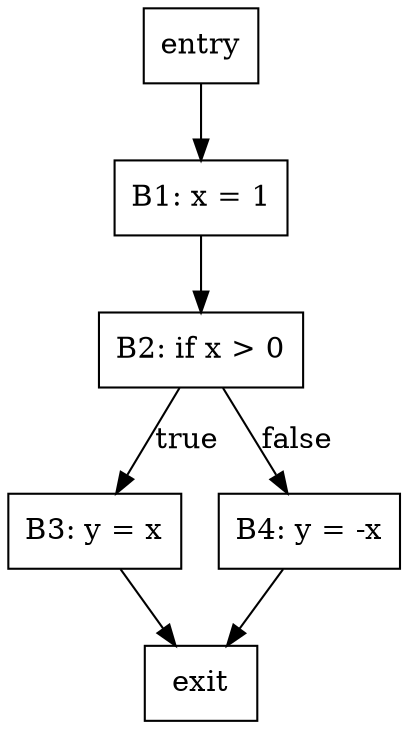

# Graphviz Setup Guide

## Overview

[Graphviz](https://graphviz.org/) is a graph visualization tool used in several exercises and mini-projects to render control flow graphs and AST diagrams.

Graphviz is **optional** for the core curriculum but **recommended** for mini-projects (especially Week 2 AST Visualizer and Week 3 Bug Finder).

## Installation

### macOS

```bash
brew install graphviz
```

### Ubuntu / Debian

```bash
sudo apt install graphviz
```

### Windows

1. Download from [graphviz.org/download](https://graphviz.org/download/)
2. Run the installer
3. Add the `bin` directory to your PATH

## Verification

```bash
dot -V
# Expected: dot - graphviz version X.X.X
```

## Usage

### From the Command Line

Create a DOT file (`example.dot`):



Render it:

```bash
# PNG output
dot -Tpng example.dot -o example.png

# SVG output (scalable)
dot -Tsvg example.dot -o example.svg

# PDF output
dot -Tpdf example.dot -o example.pdf
```

### From Python

```python
import subprocess

dot_source = """
digraph {
    A -> B -> C;
    A -> C;
}
"""

# Write and render
with open("graph.dot", "w") as f:
    f.write(dot_source)

subprocess.run(["dot", "-Tpng", "graph.dot", "-o", "graph.png"])
```

## Troubleshooting

| Issue | Solution |
|-------|----------|
| `dot: command not found` | Install Graphviz or add to PATH |
| Empty/blank output | Check DOT syntax (missing semicolons, unclosed braces) |
| Large graphs render slowly | Use `sfdp` instead of `dot` for large graphs |
